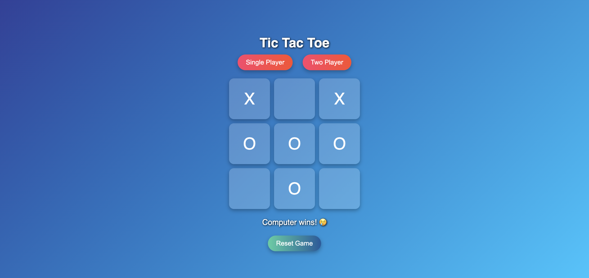

Here’s a clean and professional README.md template for your Tic Tac Toe project — ready to copy-paste and commit 🚀:

⸻

🎮 Tic Tac Toe Game

A simple, clean, and responsive Tic Tac Toe Game built with HTML, CSS, and JavaScript. Play in Single Player (vs Computer) or Two Player mode!

⸻

🚀 Live Demo
https://himanshu263.github.io/js-tic-tac-toe/
👉 Play Live on GitHub Pages

⸻

📌 Features
	•	✅ Single Player vs Computer
	•	✅ Two Player Mode
	•	✅ Stylish and responsive UI
	•	✅ Reset Game functionality
	•	✅ Simple logic with vanilla JavaScript

⸻

📸 Screenshot

⸻

🛠️ Tech Stack
	•	HTML5
	•	CSS3
	•	JavaScript (Vanilla)

⸻

📁 Project Structure

📦 js-tic-tac-toe
 ┣ 📄 index.html
 ┣ 📄 style.css
 ┣ 📄 script.js
 ┣ 📄 README.md
 ┗ 📁 assets
     ┗ 📄 scr.png

⸻

🏁 How to Use
	1.	Clone the repository:

git clone https://github.com/himanshu263/js-tic-tac-toe.git
cd js-tic-tac-toe

	2.	Open index.html in your browser or use Live Server (VS Code).
	3.	Play and enjoy!

⸻

🙌 Author

Made with ❤️ by Himanshu

⸻

You can save this file as README.md in your project and push it.

If you want, I can generate the file and upload it too — just let me know!
